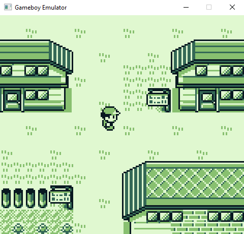

# Hermes
Hermes is a gameboy emulator written in C++. It was made as a passion project and originally started as an attempt to emulate Pokemon Red/Blue. As such, it was never meant to have perfect timings (though it does make a fair effort), so some games that heavily rely on such timings may or may not work. Additionally, sound and some lesser used memory bank controllers are not implented, along with some obscure rendering quirks.

Because of the above, I cannot confirm whether games outside of the ones shown in the screenshots below work as intended.

## Features
* All opcodes supported
* Joypad, LCD Stat, VBlank, and Timer interrupts
* Passes all of blargg's CPU tests
* MBC1, MBC3, and MBC5 support
* Background, window, and sprite rendering
* Save files

## Screenshots
 |   
 | 

## Input Controls
<table>
<tr><td>

| Action | Key |
| --- | --- |
| UP | <kbd>↑</kbd> |
| DOWN | <kbd>↓</kbd> |
| LEFT | <kbd>←</kbd> |
| RIGHT | <kbd>→</kbd> |
| B | <kbd>K</kbd> |
| A | <kbd>L</kbd> |
| START | <kbd>Enter/Return</kbd> |
| SELECT | <kbd>Right Shift</kbd> |
</td></tr> </table>

## Dependencies
Hermes uses SDL2 for the display. Note that on Windows SDL and cmake can be a bit of a hassle, so make sure that CMake can find the sdl2-config.cmake files for everything to build properly.

## Usage

### Building
Building the emulator is easily done using cmake
>mkdir build 
>cd build 
>cmake .. 
>make 

### Running
>Hermes \<ROM file> \<optional: save file name>

## Resources
Just a list of some helpful resources I've come across while working on Hermes
* https://cturt.github.io/cinoop.html
* https://imrannazar.com/Gameboy-Z80-Opcode-Map
* https://www.pastraiser.com/cpu/gameboy/gameboy_opcodes.html
* https://gbdev.gg8.se/wiki/articles/Gameboy_Bootstrap_ROM
* https://www.youtube.com/watch?v=HyzD8pNlpwI&t=3028s&ab_channel=media.ccc.de
* https://blog.tigris.fr/2019/09/15/writing-an-emulator-the-first-pixel/
* http://www.codeslinger.co.uk/pages/projects/gameboy/graphics.html